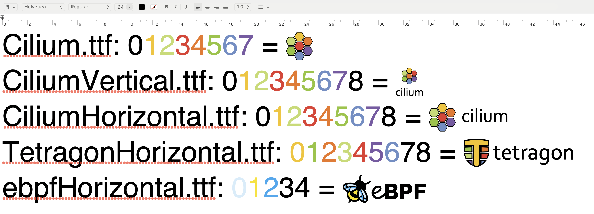

# Cilium Custom Fonts

This repository contains custom fonts created for various projects within the Cilium space. The fonts were designed using a combination of **FontForge** and **Adobe Illustrator**. Original glyphs were extracted from official source SVG files and allocated to characters `0` to `8` using FontForge.

## File Structure

- **`.sfd` files** – FontForge source files.
- **`.ttf` files** – Generated fonts from the FontForge sources.

## Installation & Usage

### Installing the Fonts

Once the fonts are installed, you can use the provided `FontTest.rtf` file to verify their appearance. A sample example is included below:

### Using the Fonts

1. Type characters `0` to `8` in any text editor or design application.
2. Assign colors accordingly to each character.
3. Highlight the colored characters and switch to the desired custom font.
4. The logo will be displayed. Adjust the size as needed.

## MacOS Usage Notes

MacOS may cache fonts, which can lead to installation issues where the fonts do not appear or fail to activate upon first use. If this occurs, try one of the following methods:

- **Reboot your system** to reset the font cache.
- Open **TextEdit**, select a font, then navigate to **"Show Fonts"** to force-refresh the font cache.

These steps have been found to resolve font visibility issues on MacOS.

---

For any issues or inquiries, feel free to open a discussion or submit an issue.
